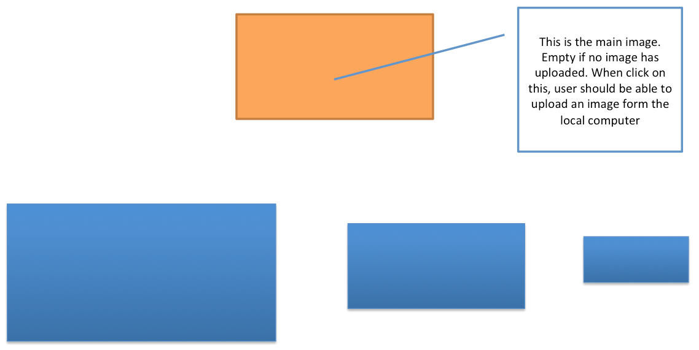

# learn-ROR

1. User browse into a page (No need of log in)

2.  a. First time when there is no previous image uploaded: See a place holder for an image (main image)

    b. Second time onwards : See a main image and the same image in 3 different sizes below it

3. When user click on the main image (or place holder), user get an option to select and upload an image from the local computer

4. When image get uploaded to server, user can see uploaded image (as the main image) and the same image in 3 different sizes below it.

5. Image should be uploaded to the server and resized at the server.

-------------------------------------------------------

* took some ideas from http://stackshare.io/500px/how-500px-serves-up-over-500tb-of-high-res-photos
* vips is a dependency (libvips-dev)
* other dependencies are mention at gem file
* need to run delayed job worker/demon
